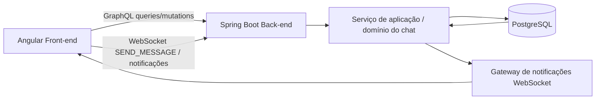

# Relatório Técnico — WIRC

## 1. Enquadramento do projeto

O **WIRC** é uma aplicação de chat multi-salas desenvolvida no âmbito da unidade curricular de **Paradigmas Emergentes para o Desenvolvimento Web e Mobile**. A solução foi construída para cumprir os objetivos do enunciado, combinando:

- **GraphQL** para operações de leitura e mutação orientadas ao domínio.
- **WebSockets** para entrega de notificações e mensagens em tempo real.
- **Front-end web** com Angular.
- **Back-end** com Spring Boot.
- **Persistência relacional** com PostgreSQL, JPA e Liquibase.

A aplicação suporta autenticação básica, criação de utilizadores, gestão de salas, envio de mensagens, pesquisa textual, estatísticas por sala, ranking de utilizadores e notificação de atividade em canais não focados.

---

## 2. Objetivos funcionais concretizados

A solução implementa os principais requisitos funcionais do projeto:

1. **Comunicação em tempo real** através de WebSocket.
2. **Camada de API estruturada com GraphQL** para consultas e mutações.
3. **Arquitetura separada entre front-end e back-end**.
4. **Aplicação explícita de design patterns** no domínio e na infraestrutura.
5. **Persistência de utilizadores, salas e estado da aplicação** em base de dados.
6. **Capacidade de evolução** para novas regras, validações e tipos de notificação.

---

## 3. Tecnologias abordadas

### 3.1 Front-end

#### Angular 20
O front-end foi implementado com **Angular 20**, recorrendo a **standalone components** em vez de módulos tradicionais. Esta opção simplifica a composição da interface e reduz o acoplamento entre artefactos de apresentação.

**Principais vantagens no projeto:**
- Estrutura moderna e modular da interface.
- Separação clara entre componentes visuais e gestão de estado.
- Boa integração com formulários, eventos e programação reativa.
- Facilidade de manutenção e escalabilidade.

#### TypeScript
A utilização de **TypeScript** trouxe tipagem estática para componentes, serviços, modelos e fluxos de estado, reduzindo erros de integração entre front-end e back-end.

#### RxJS
O estado da aplicação no cliente é coordenado com **RxJS**, usando `BehaviorSubject`, `combineLatest`, `switchMap`, `tap` e `catchError`.

**Benefícios obtidos:**
- Atualização reativa do ecrã.
- Propagação consistente de notificações, erro, utilizador autenticado e sala ativa.
- Menor duplicação de lógica assíncrona.

#### HTML + CSS
A camada visual foi construída com templates Angular e folhas de estilo CSS dedicadas por componente, permitindo uma organização mais clara da interface.

### 3.2 Back-end

#### Spring Boot 4
O servidor foi desenvolvido com **Spring Boot 4**, que oferece uma base robusta para aplicações empresariais, com suporte a injeção de dependências, configuração automática e integração com várias tecnologias.

**Uso no projeto:**
- Exposição da API GraphQL.
- Configuração do endpoint WebSocket.
- Organização do domínio de chat em serviços, controladores, repositórios e configuração.

#### Spring GraphQL
Foi usada a stack **Spring for GraphQL** para definir um contrato claro entre cliente e servidor.

**Vantagens para este projeto:**
- O cliente obtém apenas os dados de que necessita.
- Queries e mutations estão centradas no domínio da aplicação.
- Boa evolução da API sem múltiplos endpoints REST.

#### Spring WebSocket
O envio de mensagens e notificações em tempo real foi implementado com **Spring WebSocket**, permitindo manter sessões ativas com os clientes ligados.

#### Spring Data JPA
A persistência usa **JPA** para mapear entidades como utilizadores, salas, membros e mensagens para o modelo relacional.

#### Liquibase
A evolução do esquema da base de dados é controlada com **Liquibase**, garantindo versionamento das alterações estruturais e seed inicial.

### 3.3 Base de dados e infraestrutura

#### PostgreSQL
A solução usa **PostgreSQL** como sistema de gestão de base de dados relacional.

#### Docker e Docker Compose
Existe suporte para execução da infraestrutura do back-end com **Docker** e **Docker Compose**, facilitando a criação do ambiente de desenvolvimento.

### 3.4 Comunicação entre camadas

#### GraphQL
GraphQL é usado para:
- autenticação;
- criação de utilizadores;
- listagem de salas;
- consulta de mensagens;
- pesquisa;
- estatísticas;
- criação de salas;
- gestão de membros;
- foco de sala.

#### WebSockets
WebSockets são usados para:
- envio de mensagens de chat;
- difusão de notificações em tempo real;
- reação imediata da interface a novas mensagens.

---

## 4. Arquitetura da solução

A aplicação segue uma arquitetura cliente-servidor em camadas.

### 4.1 Camada de apresentação
No front-end, os componentes tratam da interação com o utilizador:
- `IdentityComponent` para autenticação e criação de utilizadores.
- `RoomsComponent` para seleção/criação de salas.
- `ChatComponent` para mensagens, pesquisa e estatísticas.
- `CanalComponent` para contexto do canal e gestão de membros.
- `AppComponent` como composição principal da interface.

### 4.2 Camada de estado e integração no front-end
A classe `ChatStore` centraliza o estado reativo da aplicação e funciona como ponto de coordenação entre componentes e o serviço HTTP/WebSocket. Já `ChatService` encapsula os detalhes de comunicação com o servidor.

### 4.3 Camada de entrada no back-end
A classe `WircController` expõe as operações GraphQL. O `ChatWebSocketHandler` recebe mensagens via WebSocket, valida o tipo de comando e encaminha o processamento para o serviço de aplicação.

### 4.4 Camada de aplicação e domínio
A interface `ChatApplication` e a implementação `ChatApplicationImpl` concentram as regras principais:
- autenticação;
- criação de utilizadores;
- gestão de salas;
- envio de mensagens;
- cálculo de estatísticas;
- autorização por utilizador/sala.

### 4.5 Camada de persistência
O acesso à base de dados é feito com repositórios JPA e entidades persistentes. O estado das salas e respetivas mensagens é reconstruído a partir da base de dados e snapshots persistidos.

---

## 5. Design patterns utilizados

## 5.1 Facade
O projeto apresenta uma **fachada de aplicação** através da interface `ChatApplication`, que fornece um ponto único de entrada para as principais operações do chat.

### Como foi aplicado
Em vez de espalhar a lógica por múltiplos controladores ou handlers, o sistema concentra as funcionalidades centrais num serviço de aplicação único, consumido tanto pelo controlador GraphQL como pelo handler WebSocket.

### Benefícios
- Redução do acoplamento entre camadas de entrada e lógica de negócio.
- Reutilização da mesma regra funcional por diferentes canais de comunicação.
- Melhor legibilidade arquitetural.

### Exemplo prático
Tanto a mutation GraphQL `sendMessage` como o `ChatWebSocketHandler` delegam o processamento para `ChatApplication`.

## 5.2 Chain of Responsibility
A validação das mensagens foi implementada com **Chain of Responsibility**.

### Como foi aplicado
Existe uma classe abstrata `MessageValidationHandler` que define a ligação entre validadores. Sobre essa base, foram criados validadores especializados:
- `RequiredFieldValidationHandler`;
- `ParticipantValidationHandler`;
- `MessageLengthValidationHandler`.

Cada elemento valida uma regra e encaminha o pedido para o próximo handler apenas se a sua própria validação tiver sucesso.

### Benefícios
- Facilidade em adicionar novas regras sem alterar o fluxo existente.
- Separação de responsabilidades.
- Melhor testabilidade unitária.

### Exemplo prático
Antes de aceitar uma mensagem, o sistema verifica campos obrigatórios, pertença do utilizador à sala e comprimento máximo permitido.

## 5.3 State
A gestão do comportamento das salas foi implementada com **State**.

### Como foi aplicado
O contrato `RoomState` define o comportamento associado aos eventos:
- envio de mensagem;
- foco da sala.

As implementações concretas são:
- `FocusedRoomState`;
- `NotifiedRoomState`.

Assim, o comportamento da sala muda consoante o seu estado interno, sem necessidade de condicional complexa espalhada pelo código.

### Benefícios
- Encapsulamento do comportamento dependente do estado.
- Código mais limpo e extensível.
- Evolução simples para novos estados futuros.

### Exemplo prático
Quando a sala está focada, uma nova mensagem pode limpar contadores; quando está em estado de notificação, o número de mensagens não lidas é incrementado.

## 5.4 Factory
A criação de sessões de sala foi implementada com **Factory** através de `ChatRoomFactory`.

### Como foi aplicado
A fábrica recebe snapshots persistidos e decide que instância de estado deve ser criada para cada sala, reconstruindo corretamente o objeto `RoomSession`.

### Benefícios
- Centralização da lógica de criação.
- Evita duplicação na reconstrução do domínio.
- Permite alterar a política de criação sem impactar consumidores.

### Exemplo prático
O método `createFromSnapshot` converte o nome do estado persistido (`FOCUSED` ou `NOTIFIED`) na respetiva implementação concreta.

## 5.5 Observer
Embora o enunciado peça dois ou mais padrões, o projeto também explora um comportamento do tipo **Observer**.

### Como foi aplicado no front-end
A `ChatStore` usa subjects e observables para propagar alterações de estado aos componentes inscritos.

### Como foi aplicado no back-end
O gateway e o handler WebSocket mantêm sessões ativas e difundem eventos para os clientes ligados.

### Benefícios
- Atualização reativa da interface.
- Baixo acoplamento entre produtores e consumidores de eventos.
- Boa adequação a cenários de tempo real.

---

## 6. Outros padrões e princípios observáveis

### 6.1 Repository
Os repositórios JPA abstraem o acesso à base de dados, separando persistência de lógica de negócio.

### 6.2 MVC / Controller-Service separation
O back-end está organizado de forma próxima de **Controller + Service + Repository**, o que ajuda a estruturar responsabilidades.

### 6.3 Dependency Injection
A aplicação tira partido da **injeção de dependências** do Spring e do Angular, promovendo baixo acoplamento e maior facilidade de teste.

### 6.4 Single Responsibility Principle
A solução demonstra preocupação com responsabilidade única:
- componentes visuais tratam da apresentação;
- o serviço Angular comunica com a API;
- a store gere estado;
- o controller expõe operações;
- o serviço de aplicação contém regras de negócio;
- os handlers validam regras específicas.

---

## 7. Fluxos principais da aplicação

## 7.1 Autenticação
1. O utilizador seleciona ou introduz credenciais no front-end.
2. O Angular invoca a mutation `signIn`.
3. O back-end valida o utilizador e devolve os dados autenticados.
4. A `ChatStore` atualiza o estado global da sessão.

## 7.2 Consulta de salas e mensagens
1. Após autenticação, o front-end pede salas via GraphQL.
2. Ao selecionar uma sala, são pedidas mensagens e estatísticas.
3. A interface atualiza-se reativamente com base no estado da store.

## 7.3 Envio de mensagens em tempo real
1. O utilizador escreve a mensagem no chat.
2. O front-end envia um comando WebSocket.
3. O `ChatWebSocketHandler` interpreta o payload.
4. O serviço de aplicação valida e persiste a mensagem.
5. O gateway difunde a notificação para os clientes ativos.
6. O front-end recebe o evento e faz refresh dos dados relevantes.

---

## 8. Estrutura funcional do sistema

### 8.1 Gestão de utilizadores
- criação de utilizador;
- autenticação;
- distinção entre utilizador selecionado e autenticado.

### 8.2 Gestão de salas
- listagem de salas visíveis para o utilizador;
- criação de novas salas;
- associação de participantes;
- adição de membros por quem tem permissão.

### 8.3 Gestão de mensagens
- envio de mensagens;
- pesquisa textual em mensagens;
- destaque de mensagens com palavras-chave relevantes;
- histórico por sala.

### 8.4 Estatísticas
- total de mensagens por sala;
- número de mensagens destacadas;
- utilizador mais ativo;
- top 3 de utilizadores.

### 8.5 Notificações
- aviso de novas mensagens em tempo real;
- controlo de mensagens não lidas;
- transição entre salas focadas e notificadas.

---

## 9. Justificação técnica das escolhas

### Angular + Spring Boot
A combinação de Angular no front-end e Spring Boot no back-end foi adequada porque oferece:
- forte separação entre cliente e servidor;
- frameworks maduras e amplamente documentadas;
- boa capacidade de evolução;
- integração simples com GraphQL e WebSockets.

### GraphQL + WebSockets
Esta combinação foi especialmente relevante para o enunciado.

- **GraphQL** resolve consultas estruturadas e operações de gestão.
- **WebSockets** respondem à necessidade de atualização imediata e comunicação bidirecional.

Assim, a aplicação usa cada tecnologia no contexto mais adequado.

### PostgreSQL + JPA + Liquibase
Estas tecnologias permitiram manter um modelo de dados relacional, persistente e versionado, com controlo explícito da evolução da base de dados.

---

## 10. Pontos fortes da solução

- Cumprimento do requisito de uso conjunto de **GraphQL** e **WebSockets**.
- Aplicação explícita e justificável de vários **design patterns**.
- Separação clara de responsabilidades entre interface, estado, serviço, controlo e persistência.
- Modelo de chat multi-sala com permissões e notificações.
- Estrutura preparada para evolução funcional.
- Código relativamente modular e fácil de testar em partes isoladas.

---

## 11. Limitações e melhorias futuras

Apesar de a solução cumprir bem os objetivos, existem evoluções possíveis:

1. **Segurança reforçada**
   - hashing de passwords;
   - autenticação baseada em token/JWT;
   - autorização mais granular.

2. **Melhorias de escalabilidade**
   - broker de mensagens para WebSockets;
   - cache para consultas frequentes;
   - paginação de mensagens.

3. **Experiência do utilizador**
   - indicadores de utilizador online;
   - typing indicators;
   - upload de ficheiros;
   - filtros de pesquisa mais avançados.

4. **Observabilidade e qualidade**
   - mais testes end-to-end;
   - métricas técnicas;
   - dashboards de monitorização.

---

## 12. Conclusão

O projeto **WIRC** demonstra uma implementação coerente de uma aplicação web moderna orientada a tempo real. A solução articula com sucesso **Angular**, **Spring Boot**, **GraphQL**, **WebSockets** e **PostgreSQL**, suportando um conjunto relevante de funcionalidades de chat multi-salas.

Do ponto de vista académico, o projeto também evidencia a aplicação prática de padrões como **Facade**, **Chain of Responsibility**, **State**, **Factory** e **Observer**, não apenas como conceitos teóricos, mas como escolhas de desenho com impacto real na organização e manutenção do código.

Em síntese, trata-se de uma solução tecnicamente consistente, alinhada com os objetivos do enunciado e adequada para demonstrar competências em arquiteturas web modernas, comunicação em tempo real e desenho orientado a padrões.
